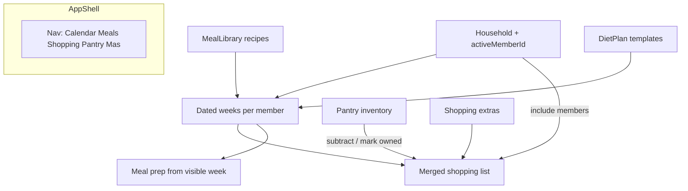
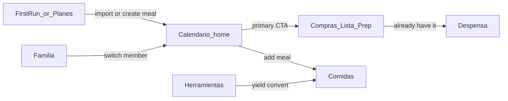
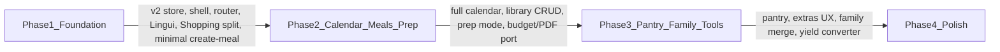

# Frontend Refactor & Feature Expansion

Phased local-first rebuild: redesigned storage, Lingui i18n, UX overhaul, calendar, meal library, meal prep, pantry, converters, shopping extras, and household profiles — still localStorage-only, no API.

---

## Current state (verdict)

The app’s intended loop is solid but incomplete: **paste diet JSON → assign day templates to weekdays → shopping list → meal prep**. Everything lives in [`src/App.jsx`](../../src/App.jsx) + `localStorage`. There is no router, no meal library, no pantry, no multi-week calendar, and no family model.

Stack: React 19 + Vite 6 + Tailwind 4, **JavaScript only**, ~4k LOC, unused `@dnd-kit`, unused `VITE_*` env flags.

Highest-friction issues to fix:

- Footer **Home = full wipe** (same as Reiniciar), not navigation
- **ToolsSidebar unreachable** (FAB commented out); substitution only mutates `weekPlan`, not the template (`updateDietPlan` is a dead prop)
- **Pinned plan load discards saved `weekPlan`**
- God-file [`ShoppingList.jsx`](../../src/components/ShoppingList.jsx) (~1.4k lines), duplicate generators, checklist key bugs (`category:name` vs `item.name` in check-all)
- Nested cards, EN/ES mix, empty folders, stub components
- Manual shopping items wiped when the list regenerates from `weekPlan`
- Extra persistence bugs: `pinnedPlans` empty array never written (deleted pins resurrect); `weekPlan` effect skips write when empty → stale LS; `dietPlan` null never removes LS key except full reset

**Constraint:** keep localStorage-first state; improve schema and accessors; **no DB/API wiring yet**.

**Default decisions:**

- Ship as **phased work** (slim Phase 1 foundation first)
- Family = **household profiles on one device** (each member has own calendar; shopping merges selected members)
- Phase 1 ships a **minimal “crear comida”** so first-run works without JSON

---

## Target information architecture



### Navigation (replace string `pageContent`)

| Section | Purpose |
|---------|---------|
| **Calendario** | Full calendar (month / week / day); week view is default home after setup |
| **Comidas** | Individual meal/recipe library + build/edit meals |
| **Compras** | Shopping list (meals + extras − pantry) **with Prep mode** (Lista \| Prep) |
| **Despensa** | Pantry inventory |
| **Más** | Familia, Herramientas, Planes, Ajustes |

Soft navigate everywhere; **Reiniciar** stays an explicit destructive action with confirm. Never label destructive reset as Home.

### Route map

| Path | Page |
|------|------|
| `/` | Calendar (or first-run / Planes if empty library + no templates) |
| `/meals` | Meal library |
| `/meals/:id` | Meal editor |
| `/meals/new` | Minimal / full create meal |
| `/shopping` | Shopping list (default) + Prep mode via `?mode=prep` or in-page tabs |
| `/pantry` | Pantry |
| `/plans` | Upload / manage diet templates |
| `/family` | Household members |
| `/tools` | Yield converter |
| `/settings` | Locale, weekStartsOn, calendar default view |

### Discoverability flow



**Primary nav (after setup):** Calendario · Comidas · Compras · Despensa · Más

**Task-oriented entry points** (Lingui), empty states + “Más → Guías rápidas”:

- Planear esta semana
- Armar lista de compras
- Preparar comidas de la semana
- Guardar comida en biblioteca
- Añadir algo a la despensa
- Incluir a la familia en la compra
- Convertir crudo ↔ cocido

---

## Storage & object model redesign

Keep localStorage-only. One **versioned document**, normalized entities, one-shot migration from scattered v1 keys.

### Current storage audit

| Key | Shape today | Issues |
|-----|-------------|--------|
| `dietPlan` | `{ days: [{ id, name, meals: [{ id, name, ingredients: [{ name, quantity }] }] }] }` | Meals only inside days; no reusable identity; `quantity` is free text |
| `weekPlan` | `{ sunday…saturday: Meal[] }` | Anonymous week; weekday keys fight `weekStartsOn`; no library link |
| `currentPlanId` | `plan_${ts}` | Labels upload only |
| `pinnedPlans` | Full `{ dietPlan, weekPlan }` snapshots | Duplicates trees; **load discards `weekPlan`**; empty array never written |
| `checkedItems` | `{ [key]: bool }` | Keys inconsistent (`category:normalizedName` vs `item.name`) |
| `mealPrep*` | Set as array + visibility | Keys `meal.name + dayName` (collision-prone) |

### Design principles for v2

1. **One document** `dietAssistant:v2` — atomic load/save
2. **One-shot migrate** — on first load: migrate → write v2 → write optional `dietAssistant:v1-backup` → stop reading legacy keys (no ongoing dual-write)
3. **Library vs instance** — reusable `Meal` / `DayTemplate` vs `ScheduledMeal` snapshots on the calendar
4. **Date-ISO keys** for calendar days — view settings never rewrite data
5. **Structured quantities** — `{ amount, unit, raw }` with parse helpers
6. **Stable ids** — `crypto.randomUUID()` on create; never Date.now alone
7. **Derived shopping** — regenerate from calendars + extras − pantry; only checklist + extras + pantry persist
8. **Names informed by** backend schema (`mealType`, `ingredients[]`) for a future mapping layer — **not sync-ready**; local enums/snapshots ≠ integer FKs

### Canonical object models

```js
// --- primitives ---
Quantity = {
  amount: number | null,   // null if unparsed
  unit: string | null,     // "g" | "tza" | "pza" | "cdita" | ...
  raw: string              // original "1/2 tza" for display/fallback
}

Ingredient = {
  id: string,
  name: string,
  quantity: Quantity,
  categoryHint?: string,
  notes?: string,
  state?: "raw" | "cooked" | null
}

MealType = "desayuno" | "colacion" | "comida" | "merienda" | "cena" | "otro"

// --- library (reusable) ---
Meal = {
  id: string,
  name: string,
  mealType: MealType,
  ingredients: Ingredient[],
  tags: string[],
  servings: number,        // default 1
  source: "user" | "import" | "template",
  createdAt: string,
  updatedAt: string
}

DayTemplate = {
  id: string,
  name: string,            // "Día 1"
  mealIds: string[],
}

DietTemplate = {
  id: string,
  name: string,
  dayTemplateIds: string[],
  createdAt: string,
  archived?: boolean
}

// --- calendar (instances) ---
ScheduledMeal = {
  instanceId: string,
  dateISO: string,
  memberId: string,
  mealId: string | null,
  name: string,            // snapshot
  mealType: MealType,
  ingredients: Ingredient[], // snapshot at schedule/edit time
  notes?: string,
  replacedFromId?: string
}

// calendars[memberId][dateISO] = ScheduledMeal[]

// --- household ---
Member = { id, name, color, createdAt }
Household = { members: Member[], activeMemberId: string }

// --- pantry & shopping ---
PantryItem = {
  id, name, quantity: Quantity, category?: string, updatedAt
}

ShoppingExtra = {
  id, name, quantity: Quantity, category?: string, note?: string, createdAt
}

// Checklist keys (single scheme — migrate from category:name and item.name):
//   "ing:{normalizedName}" | "extra:{id}"
CheckedItems = { [stableKey: string]: boolean }

// --- meal prep ---
MealPrepState = {
  weekStartISO: string,
  selectedInstanceIds: string[],  // ScheduledMeal.instanceId
  unselectedVisible: boolean
}

Settings = {
  locale: "es" | "en",
  weekStartsOn: 0 | 1 | 2 | 3 | 4 | 5 | 6,  // default 1 (Lunes)
  calendarDefaultView: "month" | "week" | "day",
  currency: "MXN"
}

UiState = {
  calendarCursorDate: string,
  calendarView: "month" | "week" | "day",
  onboardingDismissed: boolean
}
```

### Root document

```js
DietAssistantStateV2 = {
  version: 2,
  household: Household,
  mealLibrary: Meal[],
  dayTemplates: DayTemplate[],
  dietTemplates: DietTemplate[],
  calendars: { [memberId: string]: { [dateISO: string]: ScheduledMeal[] } },
  pantry: PantryItem[],
  shoppingExtras: ShoppingExtra[],
  checkedItems: CheckedItems,
  mealPrep: MealPrepState,
  settings: Settings,
  ui: UiState,
  meta: {
    migratedFrom?: "v1",
    migratedAt?: string,
    lastSavedAt: string
  }
}
```

### Quantity & ingredient helpers

`src/domain/quantity.js` + `src/domain/ingredient.js` (from today’s [`ingredientUtils.jsx`](../../src/utils/ingredientUtils.jsx)):

- `parseQuantity("1/2 tza")` → `{ amount: 0.5, unit: "tza", raw: "1/2 tza" }`
- `formatQuantity(q)` → display string
- `normalizeIngredientName(name)` — keep `SIMILAR_INGREDIENTS`
- Shopping aggregator sums by normalized name + compatible unit; incompatible units stay separate or as `raw` lines

### MealType inference (ES + EN prefixes)

Map meal name prefixes → `MealType`, default `"otro"`:

| Prefixes (case-insensitive) | MealType |
|-----------------------------|----------|
| Desayuno, Breakfast | `desayuno` |
| Media mañana, Colación, Snack, Mid-morning | `colacion` |
| Comida, Almuerzo, Lunch | `comida` |
| Merienda, Afternoon | `merienda` |
| Cena, Dinner | `cena` |

### Storage layer API (`src/storage/`)

```
loadState() -> DietAssistantStateV2
saveState(state)          // debounce; set meta.lastSavedAt
migrateV1toV2()           // one-shot from legacy keys
exportState() / importState(json)  // backup/restore (Phase 4)
resetActivePlanning()     // see reset policy below
```

**Reset policy:** Reiniciar clears **calendars, checkedItems, mealPrep, shoppingExtras** for all members; **keeps** household, mealLibrary, day/diet templates, pantry, settings. Templates are never wiped by Reiniciar. Separate “Borrar biblioteca” later if needed.

**Pin / plantilla semantics:** **Guardar plantilla** saves diet/day templates only — not calendar weeks. Calendar schedules live in `calendars`. Optional “exportar semana” later.

**React:** `AppStateProvider` holds the v2 document. Selectors/hooks (`useCalendar`, `useMealLibrary`) — React state + localStorage, not Redux/Zustand unless the tree gets painful.

### Migration map v1 → v2

1. Create default member `{ id, name: "Yo", color }`
2. For each meal in `dietPlan.days[*].meals` → `Meal` in library (parse quantities; infer `mealType` via prefix map)
3. Each diet day → `DayTemplate` with `mealIds`; whole plan → `DietTemplate`
4. Each `pinnedPlans[]` → additional `DietTemplate` (+ explode meals; dedupe by name+ingredient fingerprint when reasonable). Map that pin’s `weekPlan` onto the default member’s **current** week only when that pin is the active load path / once during migrate if it was the live week
5. Map live `weekPlan[weekday]` → `calendars[memberId][dateISO]` for the **current** week using `weekStartsOn: 1` (Monday; document)
6. Each scheduled blob → `ScheduledMeal` with new `instanceId`, snapshot ingredients, `mealId` if fingerprint matches library
7. Remap `checkedItems` → `ing:{normalized}` where possible; drop unmapped (including broken `item.name`-only keys)
8. Remap meal-prep selection to `instanceId`s when matchable; else clear
9. Write `dietAssistant:v2`; write `dietAssistant:v1-backup`; remove / stop reading legacy keys

### Validation & tests

- Lightweight validators on import/upload (extend today’s `validateDietPlan`)
- On load: if `version !== 2` or required roots missing → migrate or reset corrupted branch with toast
- Never `JSON.parse` without try/catch
- **Phase 1:** Vitest + fixtures for `parseQuantity`, checklist key remap, and one golden v1→v2 fixture (pinned + weekPlan + checkedItems)

### Files

- `src/domain/{types.js,quantity.js,ingredient.js,ids.js,mealType.js}`
- `src/storage/{migrate.js,loadSave.js}`
- `src/context/AppState.jsx`

---

## UX overhaul

Not a reskin of the indigo/gray utility UI. New product experience: clean for daily planning, colorful and inviting, discoverable without overwhelm.

### UX north star

> In under 10 seconds, a returning user knows **whose week** they’re on, **what’s for today**, and **how to get to shopping**—and can discover pantry, meals, prep, family, and tools without a tutorial wall.

### Problems to fix

- Nested white cards, mixed EN/ES, footer that **destroys data** labeled “Home”
- Primary actions buried (collapsed day templates; ToolsSidebar unreachable)
- No clear hierarchy between plan / shop / prep
- Dense shopping list; meal prep feels like a sibling app
- Zero empty states → first visit is a JSON paste wall

### Design principles

1. **One job per screen** — Calendar plans; Comidas builds; Compras buys (+ Prep); Despensa stocks; Familia configures people
2. **Progressive disclosure** — next useful action; power tools behind clear entry points
3. **Color with meaning** — meal types and categories get stable accents
4. **Fun ≠ clutter** — soft gradients, lively accents, light motion; no emoji spam / badge soup
5. **Discoverability** — ≤5 primary nav items + empty-state CTAs + lightweight Ayuda sheet
6. **Safe navigation** — soft routes; destructive actions need confirm
7. **Thumb-first mobile** — bottom nav; week calendar adapted for narrow screens
8. **Trust through feedback** — toasts; inline errors; reversible deletes where possible

### Visual language

**Direction:** “Fresh market / kitchen daylight” — airy surfaces, saturated food accents (citrus, leaf, tomato, blueberry) on a warm-neutral base.

**Avoid:** purple-on-white / purple–indigo gradients; cream+#terracotta serif brochure; broadsheet newspaper layouts; glow stacks; pill-cluster spam; multi-layer shadows; default Inter/Roboto/Arial stacks.

**Do:**

- One locked type pairing (distinctive display + readable body)
- Tokens mapped through **Tailwind v4 `@theme`** so utilities work (`bg-surface`, `text-ink`, meal accents) — not a parallel CSS-variable-only system fighting className soup
- Soft atmosphere only on first-run/landing — not behind dense data screens
- Meal chips as the main “fun” calendar element
- **2–3 intentional motions** (Phase 4): view crossfade, meal chip settle on drop, subtle checklist check — no ambient loops

Token examples: `--color-bg`, `--color-surface`, `--color-ink`, `--accent-breakfast`, `--accent-lunch`, `--accent-dinner`, `--accent-snack`, `--accent-shopping`, `--accent-pantry`, `--radius`, `--shadow-soft`, `--font-display`, `--font-body`

### Interaction patterns

| Pattern | Use |
|---------|-----|
| **Bottom / side sheet** | Add meal, substitute, extras, **per-item shopping detail** |
| **Full page** | Calendar, meal editor, shopping / prep |
| **Confirm dialog** | Reset, delete member, delete library meal in use |
| **Segmented control** | Mes / Semana / Día; Lista / Prep |
| **Chips** | Meal type, member, category filters — not quantity fragments on aisle rows |
| **Empty state** | Illustration + 1 sentence + 1 primary CTA |
| **Aisle list row** | Compras / Despensa scan line (below) |
| **Overflow menu (⋮)** | 2–4 secondary actions that must not clip inside `overflow-y-auto` |

Kill nested card-in-card. Cards only when they wrap an interactive unit.

### Aisle list rows (Compras / Despensa)

Inventory lists stay **dense and horizontal**. Canonical shopping line: [`ShoppingChecklistRow`](../../src/components/shopping/ShoppingChecklistRow.jsx) — checkbox (optional) · truncated name · qty + optional price · status chip · chevron. Tap opens [`ShoppingItemSheet`](../../src/components/shopping/ShoppingItemSheet.jsx). Despensa uses the same name / qty / trailing-action hierarchy.

**On the row:** scan and check, or open detail. **Off the row** (sheet or ⋮): Ya lo tengo, Separar, Editar, Quitar, substitute, yield, sources. Do not put a pill or extra action row under every line. Do not sit a long quantity string on the same wrapping line as the name (overlap on narrow screens). Combined items stay one truncated line; unfuse lives in the sheet.

Agent rule: [`.cursor/rules/list-rows.mdc`](../../../.cursor/rules/list-rows.mdc).

### Shell layout

- **Brand** visible in header
- **Member switcher** only from Phase 3 (Phase 1–2: single default “Yo”, no switcher chrome)
- **Calendar as home** after any meals/templates exist; otherwise Planes/first-run
- Secondary actions (Guardar plantilla, Reiniciar, Exportar PDF) in overflow / page headers

### Accessibility

- Contrast AA; don’t rely on color alone for meal type (icon or label too)
- Focus rings; hit targets ≥44px on mobile nav
- Clear Spanish (and EN via Lingui) action verbs

### UX success criteria

- **Phase 1:** empty → create ≥1 meal (minimal builder) → see it on a week surface without a README; no control implies navigation but destroys data
- **Phase 2:** returning user reaches shopping for “this week” in ≤2 taps; Prep reachable from Compras; colorful calendar still scannable
- **Phase 3:** pantry and family findable under Despensa / Más without 12 equal tabs

---

## i18n with Lingui

Adopt [Lingui](https://lingui.dev) so EN/ES mix disappears.

### Decisions

- **Source locale: `es`**; also **`en`**
- Macros: `<Trans>`, `t\`...\``, `Plural`
- Catalogs: `src/locales/{es,en}/messages.po`
- Runtime locale from `settings.locale`; switcher in Ajustes
- Dates/numbers: locale-aware formatters; still respect `weekStartsOn`
- **Do not translate** user content (meal/ingredient/pantry names) — only UI chrome
- Category and meal-type **labels** go through Lingui

### Setup (Phase 1)

1. Install `@lingui/core`, `@lingui/react`, `@lingui/macro` + Vite/SWC plugin
2. Dev: `@lingui/cli`, `@lingui/vite-plugin`
3. `lingui.config` — `locales: ["es", "en"]`, `sourceLocale: "es"`
4. Scripts: `lingui:extract`, `lingui:compile`
5. `<I18nProvider>` in [`main.jsx`](../../src/main.jsx); activate from settings on boot
6. Dynamic import of compiled catalogs on locale change

### Usage rules

- No raw user-facing string literals in new JSX
- Prefer natural Spanish source messages
- Phase 1: shell + existing screens; Phase 2: calendar + library + shopping/prep; remaining as built
- PDF strings through `t` so exports match UI locale

### Out of scope for i18n v1

- Locales beyond es/en; translating sample JSON / DeepSeek prompts; RTL

---

## Feature specs (local-only)

### 1. Full calendar system

Replace anonymous Sun–Sat tabs. **Week is primary**; month and day support.

| View | Role | UI |
|------|------|-----|
| **Semana** (default) | Planning | 7 columns by `weekStartsOn`; meal chips; tap day → day view; tap chip → edit/replace |
| **Mes** | Overview | Month grid; dots/counts; tap → day or jump week |
| **Día** | Detail | Agenda: add/replace/substitute, clear day, “usar plantilla de día” |

Shared chrome: prev/next, **Hoy**, `Mes | Semana | Día`, visible range label. Active member indicator from Phase 3.

**`weekStartsOn`:** setting in Ajustes; default Lunes (`1`); affects column order and “esta semana” only — never remaps stored ISO keys. Helpers in `src/features/calendar/dateUtils.js`.

**Scheduling:** assign diet-template day onto a date; add/replace library meals; clear day; copy day (nice-to-have); `@dnd-kit` on week grid.

**Shopping & prep** operate on the **focused week** (`calendarCursorDate` + `weekStartsOn`) with an explicit “semana visible” label.

**Retention:** soft rule — keep ~3–6 months around cursor or offer “limpiar semanas pasadas” (Phase 2 note / Phase 4 polish). Don’t leave unbounded forever.

**Not building:** Google/Outlook sync, RRULE engine, year view.

### 2. Robust meal replacements

- Replace entire meal on a day (library / template / create)
- Ingredient equivalents (`INGREDIENT_EQUIVALENTS`) apply to **instance + optionally update library**
- Clear copy when substitution has nothing to update

### 3. Meal library

- CRUD: name, type, ingredients with structured quantity
- Import: explode diet-plan days into library; keep day templates for “usar día completo”
- Builder UI (no JSON required)
- **Phase 1 minimal create:** name + ingredients → library meal + schedule onto today/week so first-run works without JSON
- Schedule onto calendar slots

### 4. Meal prep (under Compras)

- Today’s primary footer destination becomes **Compras → Prep** mode
- Select scheduled meals for the visible week via `instanceId`
- Aggregate ingredients for prep; persist selection in `MealPrepState`
- Wire in **Phase 2** with visible-week scoping (not deferred to Phase 3)

### 5. Pantry

- Inventory with qty/unit/category
- Shopping: mark “en despensa” / optionally subtract quantities
- Quick-add from checklist (“ya lo tengo → despensa”)

### 6. Weight / yield converter

- Tools page under Más: cooked↔raw factors + unit helpers
- Seed `src/data/yieldConversions.js`
- Optional apply-from-meal-editor later
- **Phase 3 only** (not Phase 1)

### 7. Shopping extras + budget/PDF

- Persist `shoppingExtras` separately from derived ingredients
- UI “Agregar a la lista” survives regeneration
- Checklist keys: **`ing:{normalizedName}`** | **`extra:{id}`** only
- **Port** existing budget ([`ingredientPrices.js`](../../src/data/ingredientPrices.js)) and `html2pdf` export to Quantity model + visible-week scope when shopping is rebuilt (**Phase 2**); Phase 4 = polish/locale only

### 8. Family / household

- Members CRUD; color + name; `activeMemberId`
- Independent calendars per member
- Shopping: multi-select members → merge week ingredients + shared extras − pantry
- Device-local only — no auth
- Member switcher chrome ships with this feature (**Phase 3**)

---

## Implementation phases



### Phase 1 — Foundation (shippable slice)

1. Storage module + v1→v2 one-shot migration + Vitest fixtures
2. Fix Home vs Reiniciar, pin→calendar restore, empty `pinnedPlans` write, stale empty `weekPlan` / null `dietPlan` LS bugs
3. Lingui setup; wrap **shell + existing screens**
4. UX foundation: tokens via Tailwind `@theme`, primitives, app shell (brand header, bottom nav — **no member switcher**), empty-state system, dismissible 3-step first-run
5. React Router with route map above; soft nav everywhere
6. **Minimal “crear comida”** so empty → week with ≥1 meal works without JSON
7. ShoppingList **structural** split (hooks/modules); extras stub persistence; remove dead/orphan UI (ToolsSidebar FAB ghost, stubs, empty folders)
8. Light shell restyle on landing → home path; defer full “market daylight” restyle of every dense screen to Phase 2

### Phase 2 — Calendar + meal library + prep

1. Calendar date utils + `weekStartsOn` setting UI (default Lunes)
2. Full calendar: **Semana** (default), **Mes**, **Día** + shared chrome
3. Meal library CRUD + import from diet templates; fuller builder
4. Schedule / replace from week & day views; `@dnd-kit` on week grid
5. Ingredient substitute on scheduled instances (+ optional library update)
6. Shopping scoped to visible week; **port budget + PDF** to new models
7. **Meal Prep mode** on Compras using `selectedInstanceIds` for visible week
8. Calendar retention soft rule or “limpiar semanas pasadas” entry point

### Phase 3 — Pantry, extras, converter, family

1. Pantry CRUD + shopping integration
2. Full extras UX
3. Yield converter page + seed data
4. Family member switcher + multi-member shopping merge
5. Month tint by member (optional polish within phase)

### Phase 4 — Polish

- Motion pass (2–3 intentional animations); empty-state illustration consistency
- Discoverability QA against success criteria
- PDF/budget locale polish; backup import/export
- Full Lingui coverage audit; dead-code cleanup
- Retention / prune polish

---

## Key files to change / add

| Action | Path |
|--------|------|
| Rewrite hub | [`src/App.jsx`](../../src/App.jsx) |
| Split / replace | [`ShoppingList.jsx`](../../src/components/ShoppingList.jsx), [`MealPlanner.jsx`](../../src/components/MealPlanner.jsx), [`MealPrepPage.jsx`](../../src/components/MealPrepPage.jsx) |
| Extract domain | [`ingredientUtils.jsx`](../../src/utils/ingredientUtils.jsx) → `src/domain/*` |
| Add | `src/storage/*`, `src/context/AppState.jsx`, `src/pages/*`, `src/data/yieldConversions.js`, `src/features/{calendar,meals,pantry,shopping,family,tools}/*` |
| Calendar | `src/features/calendar/{CalendarPage,MonthView,WeekView,DayView,dateUtils,CalendarChrome}.jsx` |
| Shopping / Prep | `src/features/shopping/{ShoppingPage,useShoppingList,useBudget,usePdfExport,PrepMode}.jsx` |
| Settings | `weekStartsOn`, `calendarDefaultView`, `locale` under Ajustes |
| i18n | `lingui.config.*`, `src/locales/{es,en}/messages.po`, `src/i18n.js` |
| UX system | `src/styles/tokens.css` (`@theme`), `src/components/ui/{Button,Sheet,EmptyState,...}`, `src/components/shell/*` |
| Tests | `src/domain/**/*.test.js`, `src/storage/migrate.test.js` |

Backend [`README_IMPROVED_SCHEMA.md`](../../../diet-assistant-backend/README_IMPROVED_SCHEMA.md) **informs** local shapes for a future mapping layer — **not wired and not claimed sync-compatible** now.

---

## Out of scope (explicit)

- Auth, cloud sync, Postgres/API calls
- Nutrition tracking UI
- Rewriting the backend
- Ongoing dual-write to legacy localStorage keys
- Year view / external calendar sync / RRULE engine
