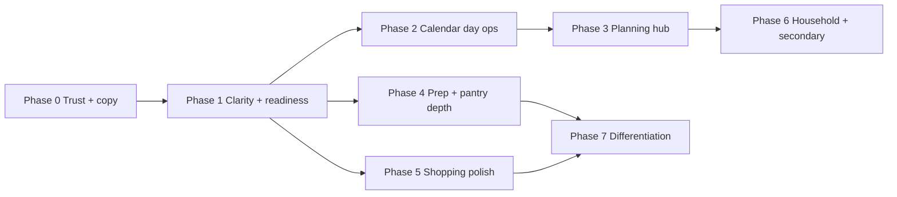

# Malanga UX Audit — Improvement Plan

Phased plan to address the whole-app UX audit (Sep 2026). Builds on the shipped v2 local-first app: day-plan slots → weekday assignment → shopping → prep → pantry, with household profiles.

**Constraint:** remain localStorage-first unless a later phase explicitly introduces sync. Prefer copy/IA and thin UI over schema churn; extend domain only when a feature needs it.

**Product narrative (for all copy & IA):**

> Malanga te ayuda a armar la semana una vez, comprarla sin sorpresas, y prepararla sin adivinar.

| Surface | Verb |
|---------|------|
| Calendario | Ver / asignar |
| Plan de semana | Armar |
| Compras | Conseguir |
| Preparar | Cocinar por lotes |
| Despensa | Restar lo que ya hay |
| Comidas | Reutilizar |

---

## Audit scorecard (baseline)

| Dimension | Score | Target after plan |
|-----------|-------|-------------------|
| Clarity of core job | 6/10 | 8.5 |
| Navigation IA | 6/10 | 8 |
| Empty / first-run | 7/10 | 9 |
| Shopping (in-store) | 8.5/10 | 9 |
| Planning (week editor) | 7/10 | 8.5 |
| Calendar day ops | 5/10 | 8 |
| Prep | 5.5/10 | 8 |
| Trust / durability | 4/10 | 8 |
| Household | 6.5/10 | 8 |
| Differentiation | 8/10 | 9 |

---

## Phase map



| Phase | Theme | Goal |
|-------|-------|------|
| **0** | Trust & hygiene | Backup/restore; remove confusing chrome; fix stale onboarding |
| **1** | Clarity & loop | Progress strip, bulk assign, Semana as command center |
| **2** | Calendar day ops | Edit / swap / remove scheduled meals without leaving day |
| **3** | Planning hub | Cold start without JSON; templates; Plans page rebuild |
| **4** | Prep & pantry | Prep checklist + batches; finish-shopping review; low stock |
| **5** | Shopping polish | Staples naming, aisle order, coach marks, progress |
| **6** | Household & Más | Cross-member copy; Más regroup; Tools decision |
| **7** | Differentiation | Leftovers, guest scale, tags/favorites, prices (optional sync later) |

Ship each phase as reviewable PRs. Do not start Phase N+1 work that depends on N until N’s acceptance criteria pass.

---

## Phase 0 — Trust & hygiene

**Why first:** localStorage-only with no user-facing backup is the highest trust risk. Cheap copy/chrome fixes reduce noise before bigger IA work.

### 0.1 Backup & restore (Settings)

Wire existing [`exportState` / `importState`](../../src/storage/loadSave.js) into Settings:

- **Exportar datos** → download JSON (`malanga-backup-YYYY-MM-DD.json`)
- **Restaurar datos** → file picker + confirm dialog (destructive replace)
- Show **Último guardado** from `meta.lastSavedAt`
- First-run / Más one-liner: “Los datos viven en este dispositivo”

### 0.2 Move prune off Calendar home

- Remove “Limpiar semanas pasadas” block from [`CalendarPage.jsx`](../../src/pages/CalendarPage.jsx)
- Keep sole entry in Settings (already present)
- Optional: confirm copy mentions library is untouched (already true)

### 0.3 Fix FirstRun / empty-state copy drift

- Step 3 currently implies Prep lives with Compras — update to standalone **Preparar** tab
- Align empty shopping / prep CTAs with current routes (`/prep`, `/plan/week`, Semana view)
- Soften Plans empty CTA so JSON is “avanzado”, not the only path (full cold-start in Phase 3)

### 0.4 Acceptance

- [x] User can export and restore a full v2 document from Settings
- [x] Calendar home has no prune control
- [x] FirstRun mentions Preparar as its own tab
- [x] No new schema version required

---

## Phase 1 — Clarity of the weekly loop

**Why:** The day-plan → assign → shop model is the product’s core; progress + bulk assign removes the steepest learning cliff.

### 1.1 Week readiness status

On Calendar (especially Semana) and optionally Shopping header, show a compact strip:

1. **Armar planes** — week plan has ≥1 day plan with meals  
2. **Asignar días** — all (or N/7) weekdays have assigned meals  
3. **Comprar** — optional: any unchecked shopping lines for visible week  
4. **Preparar** — optional: any prep selection (lighter weight)

Tap each step → deep-link (plan editor / Semana / Compras / Prep).

Implementation sketch: pure selectors over `getWeekPlan`, calendar days, shopping progress — no new persisted fields required for v1 of the strip.

### 1.2 Bulk assign (“Llenar semana”)

From Semana (DayView area or CalendarChrome when week has unassigned days):

- Assign day plans to Mon–Sun in order (or round-robin if fewer plans than days)
- Skip days that already have meals (or offer Replace all / Fill empty only)
- Toast: “X días asignados” + undo via clear? (nice-to-have)

Reuse `applyDayPlanToDate` in a loop; keep per-day override afterward.

### 1.3 Semana as command center

Tighten Calendar week view chrome:

- Primary: **Editar plan** (exists)
- Secondary: **Llenar semana** when plans exist and days empty
- When library thin: link **Nueva comida** / **Importar**
- Progress strip above WeekView

### 1.4 Copy / naming pass (minimal)

Without a full rename migration:

- Prefer “plan de día” consistently; avoid mixing “plantilla” unless we adopt it product-wide
- WeekPlanPage: shorter helper text; push detail into empty-slot CTAs
- Suggest better default names on new slots (“Menú A”) — optional microcopy only

### 1.5 Acceptance

- [x] New user (or empty week) can see what’s missing without reading a paragraph
- [x] One control assigns the week when day plans exist
- [x] FirstRun + readiness strip tell the same three-step story
- [x] Existing assignment / shopping aggregation unchanged

---

## Phase 2 — Calendar day operations

**Why:** Domain already supports `updateScheduledMeal`; DayView is read-only after assign — biggest gap between power and UI.

### 2.1 Per-meal actions on DayView

For each scheduled meal row, overflow or sheet:

| Action | Behavior |
|--------|----------|
| Editar | Open instance editor (reuse `EditScheduledMealSheet` / disposition patterns) |
| Sustituir comida | Pick from library or create; replace this instance only |
| Quitar | Remove one instance; keep rest of day |
| Abrir en biblioteca | If `mealId` set → `/meals/:id` |

Preserve “Limpiar día” and “Usar plan de día” as day-level actions.

### 2.2 Disposition when editing instances

Align with week-plan editor:

- **Solo este día** (detach / dirty instance)
- **Actualizar biblioteca** when linked `mealId`
- **Guardar como nueva** duplicate

### 2.3 Acceptance

- [x] User can fix one wrong meal without clearing the whole day
- [x] Shopping list updates after instance ingredient edits
- [x] Prep selection remains valid (instance ids stable unless removed)

---

## Phase 3 — Planning hub & cold start

**Why:** Plans page is JSON-first; Meals/Plans live under Más — creation is harder to find than execution.

### 3.1 Cold start without JSON

- Ship a **starter pack**: ~6–8 sample meals + 2 day plans
- FirstRun final CTA: “Cargar semana de ejemplo” (opt-in) → writes library + week plan for current week → optional auto-assign
- Keep JSON import under advanced / Planes

### 3.2 Rebuild Plans page

Turn [`PlansPage.jsx`](../../src/pages/PlansPage.jsx) into a hub:

| Section | Content |
|---------|---------|
| Esta semana | Edit plan · readiness · copy from last week |
| Semanas recientes | List `weekPlans` for active member · “Usar en esta semana” |
| Plantillas (later/same phase) | Named reusable day-plan sets if we add a small store |
| Avanzado | JSON import (current uploader) |

### 3.3 “Repetir semana pasada”

From CalendarChrome (week) and Plans hub:

- Copy previous week’s day plans (± assignments) into current week
- Confirm if current week already has content

Reuse week-plan copy path already used in WeekPlanPage (“Usar otra semana”).

### 3.4 Discoverability of Comidas

Without necessarily changing bottom nav:

- Badge or empty hint on Más → Comidas when library empty
- Semana empty / readiness step links to create meal
- Optional later: promote Comidas in nav (see Phase 6 IA decision)

### 3.5 Named day-plan templates (stretch in this phase)

If time allows: persist reusable day-plan definitions separate from per-week slots (small schema add under `dayPlanTemplates[]`). Otherwise ship copy-from-past-week first and defer templates to Phase 7.

### 3.6 Acceptance

- [ ] New install can reach a shoppable week without pasting JSON
- [ ] Plans page lists past weeks and copy actions
- [ ] “Repetir semana pasada” available from calendar week chrome

---

## Phase 4 — Prep & pantry depth

### 4.1 Prep v2

Extend [`PrepMode.jsx`](../../src/features/shopping/PrepMode.jsx):

1. Keep meal multi-select
2. Aggregated ingredients become a **checklist** (checked state keyed by week + ingredient stable key; clear when week changes)
3. Optional grouping: by category first; later by action (lavar / picar / cocer / porcionar) if we add lightweight tags
4. PDF or share text export of prep list (reuse shopping PDF patterns where possible)

### 4.2 Finish-shopping review

Before `finishShoppingToPantry`:

- Sheet listing checked items with editable qty
- Confirm → pantry
- Toast with undo window (restore previous pantry snapshot) — nice-to-have

### 4.3 Pantry improvements

- Quick ± on qty in row or sheet
- Optional **low-stock** threshold (schema: `PantryItem.lowStockAt?: Quantity`) + badge in list / shopping hint
- Defer expiry dates unless product asks for them

### 4.4 Acceptance

- [ ] Prep session can be checked off at the counter
- [ ] Finishing shopping shows a review step
- [ ] Low-stock (if shipped) surfaces in pantry list

---

## Phase 5 — Shopping polish

Shopping is already the strongest surface; keep changes additive and aligned with [list-rows](../../../.cursor/rules/list-rows.mdc).

### 5.1 Naming & coach

- Rename “Extras persistentes” → **Siempre comprar** / **Fijos** (i18n)
- First-time coach mark (dismissible, `ui.shoppingChecklistHintDismissed`): “Usa Checklist en la tienda”

### 5.2 Progress & aisle order

- Header: `N/M comprados · ~$X MXN` (budget already estimated)
- User-defined **category order** in Settings or shopping overflow (persist `settings.shoppingCategoryOrder: string[]`)
- Uncategorized / Other always last

### 5.3 Checked-item hygiene

- “Desmarcar todo” already exists in checklist — ensure discoverable in overflow
- Allow clear checked without “Terminar” (already via uncheck) — document in coach only if needed

### 5.4 Acceptance

- [ ] Staples label is consumer-facing
- [ ] Checklist hint shown once
- [ ] Category order persists across sessions

---

## Phase 6 — Household, Más, Tools

### 6.1 Cross-member planning helpers

- **Copiar plan de [miembro] → activo** (week plans ± calendar assignments for one week)
- Optional read-only **“Hoy en casa”** strip: each member’s dinner (or next meal) — Más or Calendar

### 6.2 Regroup Más

```
Planificar
  · Comidas
  · Planes
Hogar
  · Familia
  · Despensa shortcut? (already in nav — skip)
Preferencias
  · Ajustes
  · Herramientas (or hide — see 6.3)
Datos
  · Export / hint (or only in Ajustes)
```

### 6.3 Tools decision

Yield converter is duplicated conceptually with shopping yield modes:

- **Option A (preferred):** Keep Tools as thin utility + link from shopping item sheet “Abrir convertidor”
- **Option B:** Remove Tools from Más; document yield only in-context
- Do not expand Tools into a junk drawer in this phase

### 6.4 Nav IA decision (explicit checkpoint)

Revisit bottom nav only after Phases 1–3:

| Option | Tabs |
|--------|------|
| Keep | Calendario · Compras · Preparar · Despensa · Más |
| Alt | Calendario · Comidas · Compras · Preparar · Más (Despensa under Más / Shopping) |

Document choice in PR; default = keep current unless metrics/usability say Comidas > Despensa in primary nav.

### 6.5 Acceptance

- [ ] Copy week plan across household members
- [ ] Más is sectioned, not a flat dump
- [ ] Tools fate decided and reflected in nav copy

---

## Phase 7 — Differentiation & later

Ship selectively; each item can be its own mini-phase.

| Feature | Notes |
|---------|--------|
| Leftovers / cook-once | Link instances across days; prep shows “rinde N comidas” |
| Guest scaling | Scale one meal or whole day by factor; shopping reflects |
| Meal tags & favorites | Use unused `tags[]`; filter in library |
| “Usado esta semana” sort | Library browser |
| Price personalization | Override `ingredientPrices` entries in settings |
| Budget target | Soft warn when estimate exceeds target |
| Tonight board | Household multi-member dinner view |
| Nutrition (optional) | Only if it does not dilute shop/prep focus |
| Multi-device sync | Out of local-first scope — separate architecture plan |

### 7.1 Acceptance (per feature)

- [ ] Feature has empty state + i18n (es source + en)
- [ ] Does not break shopping aggregation or week assignment
- [ ] Documented in this file under “Shipped” when done

---

## Cross-cutting requirements (every phase)

1. **i18n:** Spanish source strings + English `msgstr` via Lingui (`bun run lingui:extract` / compile). See [.cursor/rules/i18n-lingui.mdc](../../../.cursor/rules/i18n-lingui.mdc).
2. **List rows:** Shopping/pantry density rules unchanged unless intentionally redesigned.
3. **Bun:** `bun` for install/scripts, not npm.
4. **Tests:** Prefer unit tests next to domain (week plan, shopping progress, prep keys) for new selectors/actions.
5. **No drive-by refactors** outside the phase’s file touch list.
6. **Schema:** Prefer soft-normalize in `normalizeV2State`; bump only when needed and migrate in `migrate.js`.

---

## Suggested PR / delivery order

| PR | Phase slice |
|----|-------------|
| 1 | 0.1–0.3 Trust + copy + prune move |
| 2 | 1.1 Readiness strip |
| 3 | 1.2–1.3 Bulk assign + Semana CTAs |
| 4 | 2.x Day meal actions |
| 5 | 3.1–3.3 Cold start + Plans hub + repeat week |
| 6 | 4.1 Prep checklist |
| 7 | 4.2–4.3 Finish review + pantry |
| 8 | 5.x Shopping polish |
| 9 | 6.x Household + Más |
| 10+ | 7.x as product picks |

---

## Out of scope (this plan)

- Backend / auth / multi-device sync (unless Phase 7 opens a new plan)
- Full TypeScript migration
- Rewriting ShoppingList into a new architecture unless a phase explicitly requires it
- Changing the core day-plan → assign model (we clarify and accelerate it, not replace it)

---

## Traceability (audit → phase)

| Audit finding | Phase |
|---------------|-------|
| No backup/export UI | 0 |
| Prune duplicated on calendar | 0 |
| FirstRun Prep copy wrong | 0 |
| Two-step model under-explained | 1 |
| Creation buried vs execution nav | 1, 3, 6 |
| No week readiness | 1 |
| No bulk assign | 1 |
| DayView read-only | 2 |
| Plans page JSON-only | 3 |
| Cold start needs JSON | 3 |
| No repeat last week CTA | 3 |
| Prep stops at ingredient dump | 4 |
| No finish-shopping review | 4 |
| Pantry manual / no low stock | 4 |
| Extras naming / checklist discoverability | 5 |
| No aisle order | 5 |
| Household planning siloed | 6 |
| Más flat / Tools orphaned | 6 |
| Leftovers, scale, tags, prices, sync | 7 |
| Tags unused in UI | 7 |
| Servings impact unclear | 2–3 (document + optional scale) |

---

## Shipped log

_Record completed slices here as they land._

| Date | Phase | Notes |
|------|-------|-------|
| 2026-09-06 | 0 | Settings export/restore + lastSavedAt; prune removed from Calendar; FirstRun Prep tab copy; Plans JSON under Avanzado; device-data note on Más/Settings/FirstRun |
| 2026-09-06 | 1 | Week readiness selectors + fillEmptyWeekDays; Autocompletar + N/7 asignados in CalendarChrome (strip panel removed as out of place) |
| 2026-09-06 | 2 | DayView per-meal ⋮: edit (disposition), replace from library, remove, open in library |
